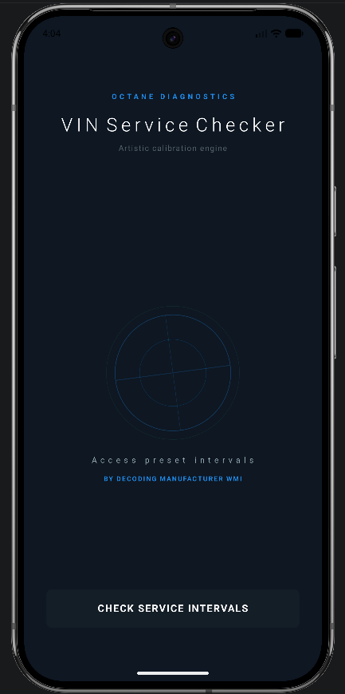
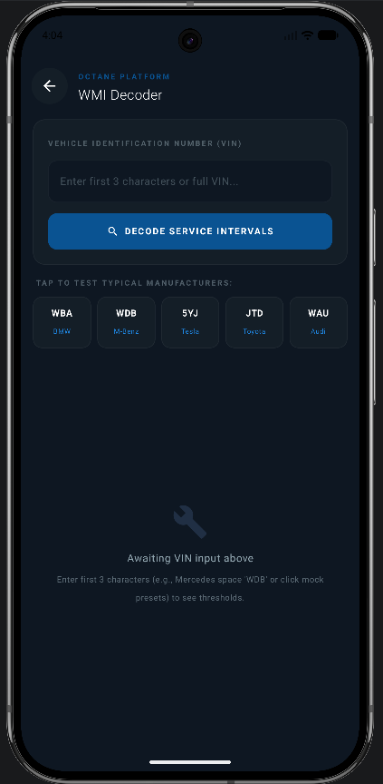
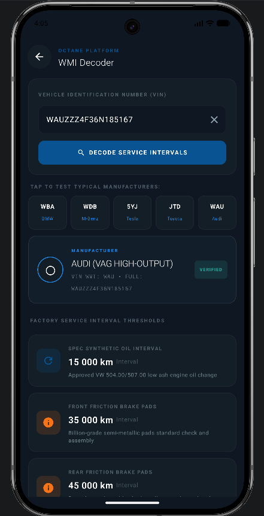

# VIN Service Checker 🚘

A modern Android application built with **Kotlin** and **Jetpack Compose** that allows users to enter a vehicle VIN number and instantly receive predefined manufacturer-based service intervals.

The app uses a lightweight **in-memory VIN decoding system** without any database or backend dependency.

---

# 📱 Application Preview

## Home Screen




## VIN Decoder Screen




---

## Service Intervals Result




---
## ✨ Features

- 🔍 VIN number decoding based on WMI (World Manufacturer Identifier)
- 🚗 Manufacturer recognition using the first 3 VIN characters
- 🛠️ Displays service intervals for:
  - Oil changes
  - Brake pads
  - Air filters
  - Timing belts
  - Coolant replacement
- ⚡ Fully in-memory logic (no database)
- 🎨 Modern dark UI with blue ambient highlights
- 🧩 MVVM architecture
- 📱 Single Activity architecture
- ⏳ Smooth loading animation while processing VIN
- 🃏 Elegant service interval cards

---

# 🏗️ Architecture

### Pattern Used

- **MVVM (Model-View-ViewModel)**
- **Single Activity Architecture**
- **Jetpack Compose Navigation Style**
- **State-driven UI**

---


# 📦 Tech Stack

- **Kotlin**
- **Jetpack Compose**
- **Material 3**
- **MVVM Architecture**
- **Coroutines**
- **ViewModel**
- **KSP**

---

# 📋 Requirements

To run the project locally, you need:

## Software

- Android Studio Hedgehog or newer
- JDK 11
- Gradle 8+
- Android SDK 36

---

## Minimum SDK

```kotlin
minSdk = 24
```

---

## Target SDK

```kotlin
targetSdk = 36
```

---

# ▶️ How To Run

1. Clone the repository

```bash
git clone <your-repository-url>
```

2. Open the project in Android Studio

3. Sync Gradle

4. Run the application on:
   - Android Emulator
   - Physical Android Device


---
# 📄 License

MIT License

---
